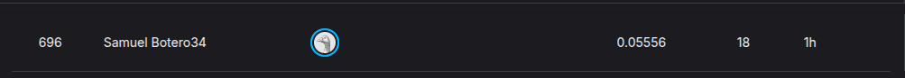

# Taller 1: Predicción de Riesgo de Accidentes

Este repositorio contiene el desarrollo del Taller 1, enfocado en la creación de modelos de machine learning para predecir el riesgo de accidentes de tráfico. El proyecto se basa en la competencia de Kaggle: [Playground Series - S5E10](https://www.kaggle.com/competitions/playground-series-s5e10/overview).

## 🚀 Resultados en la Competición

Los modelos fueron evaluados en la competición, obteniendo los siguientes resultados.

| Modelo                 | Score (RMSE) | Posición en Leaderboard |
| :--------------------- | :----------: | :---------------------: |
| **Ensamble Stacking** | **0.05556** |    **696** |
| Modelo Lineal (Ridge)  |   0.07199    |          2559           |

---

## 🤖 Comparación de Modelos

### Modelo Lineal (Baseline)

Se implementó un modelo de **Regresión Ridge** como punto de partida. Este modelo fue entrenado únicamente con los datos originales proporcionados. Aunque es rápido, su naturaleza lineal y la falta de información adicional limitaron su capacidad para capturar las interacciones complejas del problema. Esto se reflejó en un score de **0.07199**, ubicándose en la posición **2559**.

### Ensamble Stacking (Modelo Avanzado)

Para mejorar el rendimiento, se construyó un **ensamble de stacking**, que resultó ser un enfoque muy superior por dos razones clave:

1.  **Ventaja Informativa (Datos Sintéticos)**: La diferencia más significativa fue el uso de **aumentación de datos**. Se utilizó una función para generar datos sintéticos que, según se infiere, replicaba la lógica con la que se crearon los datos de la competencia. Al entrenar el ensamble con estos datos sintéticos además de los reales, el modelo obtuvo una "vista previa" de la estructura subyacente del problema. Esta fue una ventaja fundamental que el modelo lineal no tuvo.

2.  **Arquitectura de Ensamble Avanzada**:
    * **Combina Fortalezas**: El ensamble utilizó tres modelos base robustos (**XGBoost, LightGBM y CatBoost**), cada uno experto en identificar diferentes tipos de patrones.
    * **Meta-aprendizaje**: En lugar de simplemente promediar, el stacking añade un "meta-modelo" (`Ridge`) que aprende a ponderar de forma inteligente las predicciones de los modelos base, creando una predicción final más precisa y robusta.

Gracias a la combinación de una arquitectura de modelo superior y, crucialmente, al entrenamiento con datos sintéticos informativos, el ensamble logró un score de **0.05556**, lo que nos posicionó en el **lugar 696** del leaderboard.

---

## 🛠️ Estructura del Repositorio

* `/data`: Contiene los datasets de entrenamiento (`train.csv`) y prueba (`test.csv`).
* `punto1.ipynb` a `punto4.ipynb`: Notebooks con el desarrollo de la solución, desde el análisis exploratorio hasta el modelado final.
* `/submission files`: Contiene los archivos de envío generados, incluyendo `submission_ensemble.csv` y `submission_lineal.csv`.
